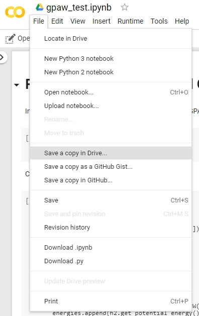

## Part 1: DFT Demo

Both ASE and GPAW operate through Python. We will be using Google’s Colab service to make it easy to follow along.
No need to install Python locally - you only need a browser. Our code will be running in a Jupyter notebook
using Google’s resources. 

To access the first Python notebook just follow
[this link](https://colab.research.google.com/drive/1uaHuh2K8wn6XjVm-aAYB30-G98NpNcH5) and then
click on ‘File’ > ‘Save a copy in Drive…’. 

{fig-align="center" width=300px}

Once you have copied the notebook to your Google Drive you can edit, execute and work on it.

## Part 2: Materials Informatics Pipeline Demo

We will use Matminer, DScribe, pandas, and Scikit-Learn to demonstrate a full ML pipeline applied to a materials science dataset.

To access the second Python notebook just follow
[this link](https://colab.research.google.com/drive/1JyA5lpztm0BC3rElJZiPYg8qriksVNNR) and then
click on ‘File’ > ‘Save a copy in Drive…’. 

{fig-align="center" width=300px}