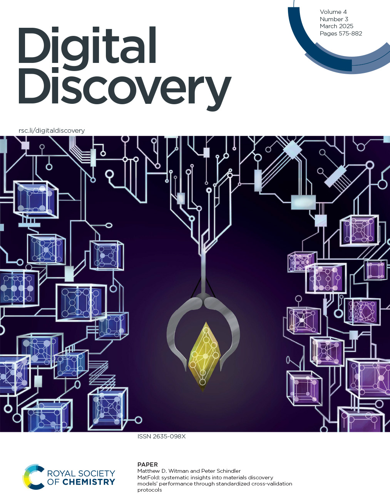
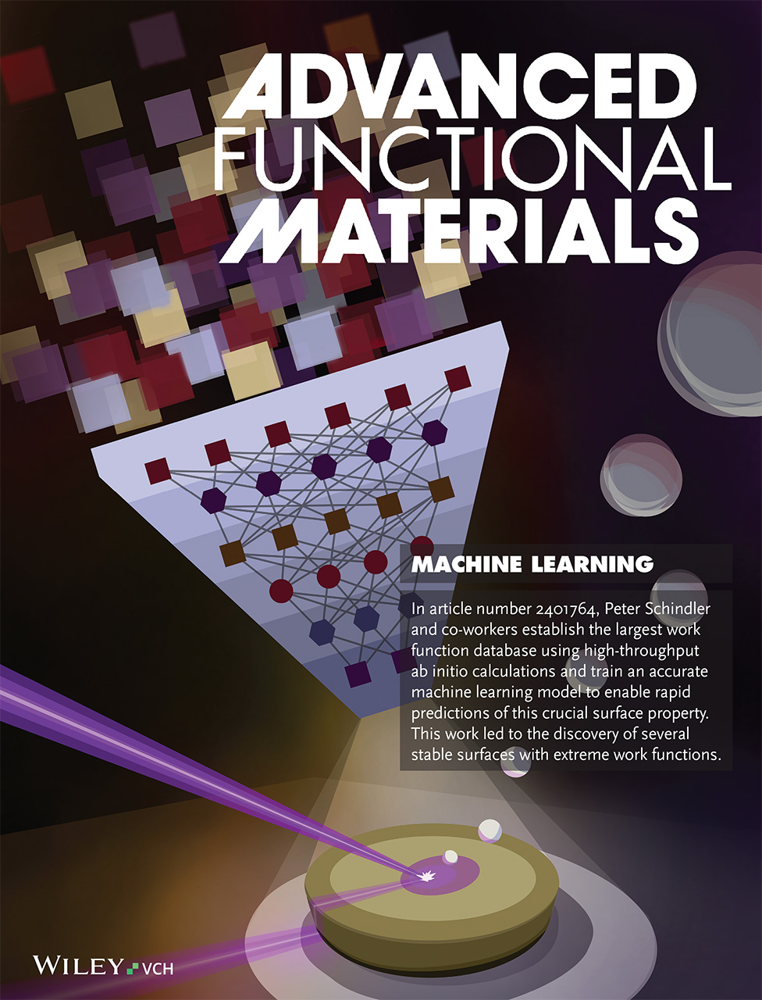
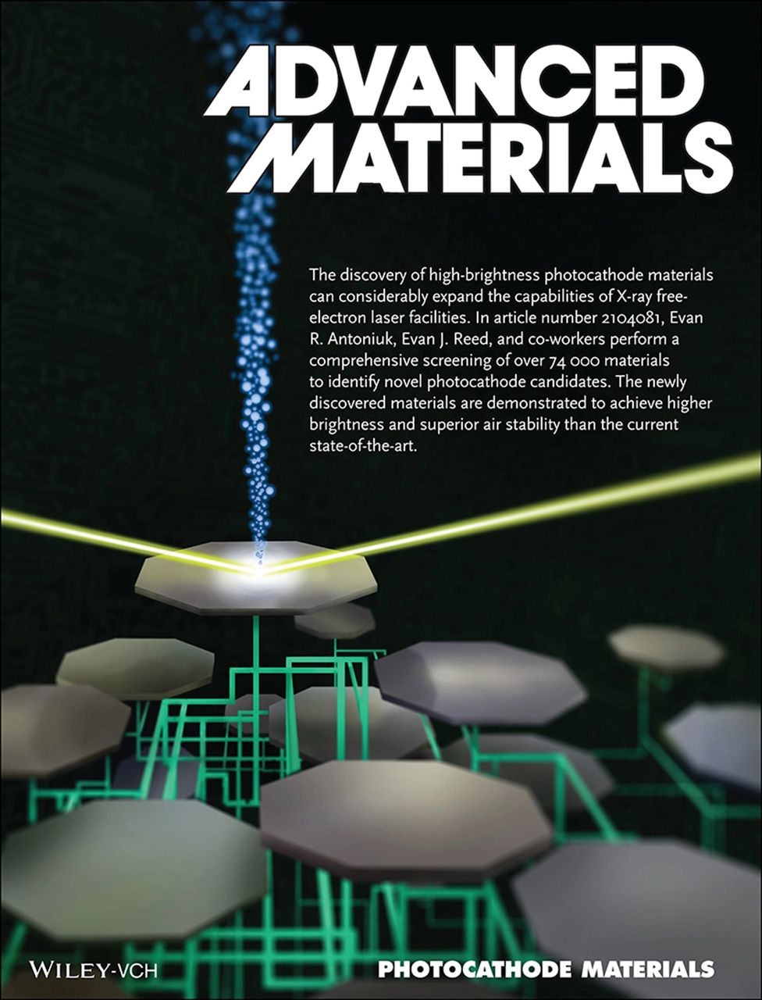
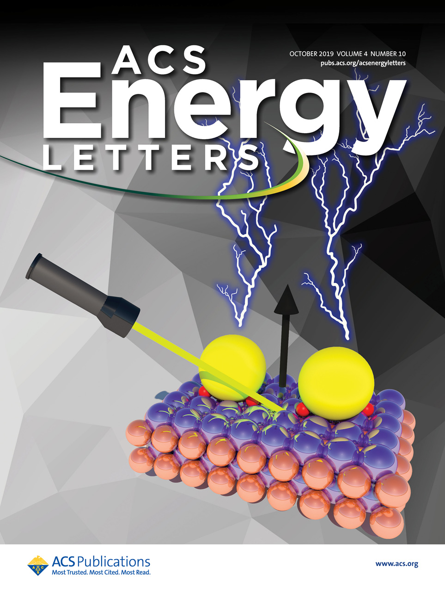
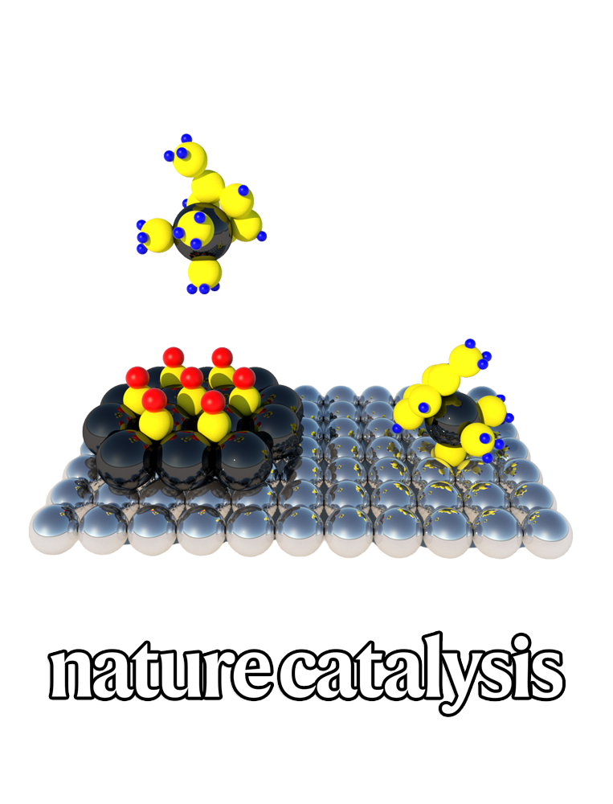

## Highlights

::: {layout="[[32.0,-2.0,32.0,-2.0,32.0]]"}





:::

::: {layout="[[32.0,-2.0,32.0,-2.0,32.0]]"}





:::

## Publications

::: {.cell execution_count=1}

::: {.cell-output .cell-output-display}

```{=html}
<sup>&#10033;</sup> contributed equally, <sup><b>&#x25C7;</b></sup> corresponding author<br><br><ol class="rbracket" style="counter-reset: num 25;list-style-type: none;">
<li value='24'>
<i>Surface stability modeling with universal machine learning interatomic potentials: a comprehensive cleavage energy benchmarking study</i><br>
<b>AI Sci. 1, 2 (2025)</b> 025002<br>
<small>A. Mehdizadeh and <em class="text-primary">P. Schindler</em></small><br>
<a class="btn btn-outline-primary btn-sm", href="https://doi.org/10.1088/3050-287X/ae1408" target="_blank" rel="noopener noreferrer">
    <i class="ai ai-archive" role='img' aria-label='Published'></i> Published </a> <a class="btn btn-outline-primary btn-sm", href="https://arxiv.org/abs/2508.21663" target="_blank" rel="noopener noreferrer">
    <i class="bi bi-file-earmark-pdf" role='img' aria-label='Preprint'></i> Preprint </a> <a class="btn btn-outline-primary btn-sm", href="https://github.com/d2r2group/mlip-cleavage-benchmark" target="_blank" rel="noopener noreferrer">
    <i class="bi bi-github" role='img' aria-label='GitHub'></i> GitHub </a></li><li value='23'>
<i>FIRE-GNN: Force-informed, Relaxed Equivariance Graph Neural Network for Rapid and Accurate Prediction of Surface Properties</i><br>
<b>arXiv  (2025)</b> <br>
<small>C. Hsu, C. Schlesinger, K. Mudaliar, J. Leung, R. Walters, and <em class="text-primary">P. Schindler</em></small><br>
 <a class="btn btn-outline-primary btn-sm", href="https://arxiv.org/abs/2508.16012" target="_blank" rel="noopener noreferrer">
    <i class="bi bi-file-earmark-pdf" role='img' aria-label='Preprint'></i> Preprint </a></li><li value='22'>
<i>MatFold: systematic insights into materials discovery models' performance through standardized cross-validation protocols</i><br>
<b>Digit. Discov. 4, 3 (2025)</b> 625–635<br>
<small>M. D. Witman and <em class="text-primary">P. Schindler</em><sup><b>&#x25C7;</b></sup></small><br>
<a class="btn btn-outline-primary btn-sm", href="https://doi.org/10.1039/D4DD00250D" target="_blank" rel="noopener noreferrer">
    <i class="ai ai-archive" role='img' aria-label='Published'></i> Published </a> <a class="btn btn-outline-primary btn-sm", href="https://doi.org/10.26434/chemrxiv-2024-bmw1n" target="_blank" rel="noopener noreferrer">
    <i class="bi bi-file-earmark-pdf" role='img' aria-label='Preprint'></i> Preprint </a> <a class="btn btn-outline-primary btn-sm", href="https://github.com/d2r2group/MatFold/" target="_blank" rel="noopener noreferrer">
    <i class="bi bi-github" role='img' aria-label='GitHub'></i> GitHub </a></li><li value='21'>
<i>Discovery of Stable Surfaces with Extreme Work Functions by High-Throughput Density Functional Theory and Machine Learning</i><br>
<b>Adv. Funct. Mater. 34, 19 (2024)</b> 2401764<br>
<small><em class="text-primary">P. Schindler</em><sup><b>&#x25C7;</b></sup>, E. R. Antoniuk, G. Cheon, Y. Zhu, and E. J. Reed</small><br>
<a class="btn btn-outline-primary btn-sm", href="https://doi.org/10.1002/adfm.202401764" target="_blank" rel="noopener noreferrer">
    <i class="ai ai-archive" role='img' aria-label='Published'></i> Published </a> <a class="btn btn-outline-primary btn-sm", href="https://arxiv.org/abs/2011.10905" target="_blank" rel="noopener noreferrer">
    <i class="bi bi-file-earmark-pdf" role='img' aria-label='Preprint'></i> Preprint </a> <a class="btn btn-outline-primary btn-sm", href="https://github.com/d2r2group/WF-RF-Model/" target="_blank" rel="noopener noreferrer">
    <i class="bi bi-github" role='img' aria-label='GitHub'></i> GitHub </a></li><li value='20'>
<i>Revealing Large Room-Temperature Nernst Coefficients in 2D Materials by First-Principles Modeling</i><br>
<b>Nanoscale 16, 12 (2024)</b> 6142–6150<br>
<small>S. E. Rezaei and <em class="text-primary">P. Schindler</em><sup><b>&#x25C7;</b></sup></small><br>
<a class="btn btn-outline-primary btn-sm", href="https://doi.org/10.1039/D3NR06127B" target="_blank" rel="noopener noreferrer">
    <i class="ai ai-archive" role='img' aria-label='Published'></i> Published </a> <a class="btn btn-outline-primary btn-sm", href="https://www.doi.org/10.26434/chemrxiv-2023-7p14b" target="_blank" rel="noopener noreferrer">
    <i class="bi bi-file-earmark-pdf" role='img' aria-label='Preprint'></i> Preprint </a></li><li value='19'>
<i>Electrolyte Coatings for High Adhesion Interfaces in Solid-State Batteries from First Principles</i><br>
<b>ACS Appl. Mater. Interfaces 15, 37 (2023)</b> 44394-44403<br>
<small>B. Ransom, A. Ramdas, E. Lomeli, J. Fidawi, A. Sendek, T. Devereaux, E. J. Reed, and <em class="text-primary">P. Schindler</em><sup><b>&#x25C7;</b></sup></small><br>
<a class="btn btn-outline-primary btn-sm", href="https://doi.org/10.1021/acsami.3c04452" target="_blank" rel="noopener noreferrer">
    <i class="ai ai-archive" role='img' aria-label='Published'></i> Published </a> <a class="btn btn-outline-primary btn-sm", href="https://arxiv.org/abs/2303.16350" target="_blank" rel="noopener noreferrer">
    <i class="bi bi-file-earmark-pdf" role='img' aria-label='Preprint'></i> Preprint </a></li><li value='18'>
<i>Improving intrinsic oxygen reduction activity and stability: Atomic layer deposition preparation of platinum-titanium alloy catalysts</i><br>
<b>Appl. Catal., B 300 (2022)</b> 120741<br>
<small>Y. Kim, S. Xu, J. Park, A. L. Dadlani, O. Vinogradova, D. Krishnamurthy, M. Orazov, D. U. Lee, S. Dull, <em class="text-primary">P. Schindler</em>, H. S. Han, Z. Wang, T. Graf, T. D. Schladt, J. E. Mueller, R. Sarangi, R. Davis, V. Viswanathan<sup><b>&#x25C7;</b></sup>, T. F. Jaramillo<sup><b>&#x25C7;</b></sup>, D. C. Higgins<sup><b>&#x25C7;</b></sup>, and F. B. Prinz<sup><b>&#x25C7;</b></sup></small><br>
<a class="btn btn-outline-primary btn-sm", href="https://doi.org/10.1016/j.apcatb.2021.120741" target="_blank" rel="noopener noreferrer">
    <i class="ai ai-archive" role='img' aria-label='Published'></i> Published </a></li><li value='17'>
<i>Novel Ultrabright and Air-Stable Photocathodes Discovered from Machine Learning and Density Functional Theory Driven Screening</i><br>
<b>Adv. Mater. 33, 44 (2021)</b> 2104081<br>
<small>E. R. Antoniuk<sup><b>&#x25C7;</b></sup>, <em class="text-primary">P. Schindler</em>, W. A. Schroeder, B. Dunham, P. Pianetta, T. Vecchione, and E. J. Reed<sup><b>&#x25C7;</b></sup></small><br>
<a class="btn btn-outline-primary btn-sm", href="https://doi.org/10.1002/adma.202104081" target="_blank" rel="noopener noreferrer">
    <i class="ai ai-archive" role='img' aria-label='Published'></i> Published </a></li><li value='16'>
<i>Direct Integration of Strained-Pt Catalysts into Proton-Exchange-Membrane Fuel Cells with Atomic Layer Deposition</i><br>
<b>Adv. Mater. 33, 30 (2021)</b> 2007885<br>
<small>S. Xu<sup><b>&#x25C7;</b></sup>, Z. Wang, S. Dull, Y. Liu, D. U. Lee, J. S. L. Pacheco, M. Orazov, P. E. Vullum, A. L. Dadlani, O. Vinogradova, <em class="text-primary">P. Schindler</em>, Q. Tam, T. D. Schladt, J. E. Mueller, S. Kirsch, G. Huebner, D. Higgins, J. Torgersen, V. Viswanathan, T. F. Jaramillo, and F. B. Prinz<sup><b>&#x25C7;</b></sup></small><br>
<a class="btn btn-outline-primary btn-sm", href="https://doi.org/10.1002/adma.202007885" target="_blank" rel="noopener noreferrer">
    <i class="ai ai-archive" role='img' aria-label='Published'></i> Published </a></li><li value='15'>
<i>Generalizable density functional theory based photoemission model for the accelerated development of photocathodes and other photoemissive devices</i><br>
<b>Phys. Rev. B 101, 23 (2020)</b> 235447<br>
<small>E. R. Antoniuk, Y. Yue, Y. Zhou, <em class="text-primary">P. Schindler</em>, W. A. Schroeder, B. Dunham, P. Pianetta, T. Vecchione, and E. J. Reed</small><br>
<a class="btn btn-outline-primary btn-sm", href="https://doi.org/10.1103/PhysRevB.101.235447" target="_blank" rel="noopener noreferrer">
    <i class="ai ai-archive" role='img' aria-label='Published'></i> Published </a></li><li value='14'>
<i>Surface Photovoltage-Induced Ultralow Work Function Material for Thermionic Energy Converters</i><br>
<b>ACS Energy Lett. 4, 10 (2019)</b> 2436–2443<br>
<small><em class="text-primary">P. Schindler</em><sup><b>&#x25C7;</b></sup>, D. C. Riley, I. Bargatin, K. Sahasrabuddhe, J. W. Schwede, S. Sun, P. Pianetta, Z. Shen, R. T. Howe, and N. A. Melosh</small><br>
<a class="btn btn-outline-primary btn-sm", href="https://doi.org/10.1021/acsenergylett.9b01214" target="_blank" rel="noopener noreferrer">
    <i class="ai ai-archive" role='img' aria-label='Published'></i> Published </a></li><li value='13'>
<i>Electrical Properties of Ultrathin Platinum Films by Plasma-Enhanced Atomic Layer Deposition</i><br>
<b>ACS Appl. Mater. Interfaces 11, 9 (2019)</b> 9594–9599<br>
<small>H. J. K. Kim<sup><b>&#x25C7;</b></sup>, K. E. Kaplan, <em class="text-primary">P. Schindler</em>, S. Xu, M. M. Winterkorn, D. B. Heinz, T. S. English, J. Provine, F. B. Prinz, and T. W. Kenny</small><br>
<a class="btn btn-outline-primary btn-sm", href="https://doi.org/10.1021/acsami.8b21054" target="_blank" rel="noopener noreferrer">
    <i class="ai ai-archive" role='img' aria-label='Published'></i> Published </a></li><li value='12'>
<i>Extending the limits of Pt/C catalysts with passivation-gas-incorporated atomic layer deposition</i><br>
<b>Nat. Catal. 1 (2018)</b> 624–630<br>
<small>S. Xu, Y. Kim, J. Park, D. Higgins, S. Shen, <em class="text-primary">P. Schindler</em>, D. Thian, J. Provine, J. Torgersen, T. Graf, T. D. Schladt, M. Orazov, B. H. Liu, T. F. Jaramillo, and F. B. Prinz<sup><b>&#x25C7;</b></sup></small><br>
<a class="btn btn-outline-primary btn-sm", href="https://doi.org/10.1038/s41929-018-0118-1" target="_blank" rel="noopener noreferrer">
    <i class="ai ai-archive" role='img' aria-label='Published'></i> Published </a></li><li value='11'>
<i>Self-limiting atomic layer deposition of barium oxide and barium titanate thin films using a novel pyrrole based precursor</i><br>
<b>J. Mater. Chem. C 4, 10 (2016)</b> 1945–1952<br>
<small>S. Acharya<sup>&#10033;</sup><sup><b>&#x25C7;</b></sup>, J. Torgersen<sup>&#10033;</sup><sup><b>&#x25C7;</b></sup>, Y. Kim, J. Park, <em class="text-primary">P. Schindler</em>, A. L. Dadlani, M. Winterkorn, S. Xu, S. P. Walch, T. Usui, C. Schildknecht, and F. B. Prinz</small><br>
<a class="btn btn-outline-primary btn-sm", href="https://doi.org/10.1039/C5TC03561A" target="_blank" rel="noopener noreferrer">
    <i class="ai ai-archive" role='img' aria-label='Published'></i> Published </a></li><li value='10'>
<i>Plasma-enhanced atomic layer deposition of barium titanate with aluminum incorporation</i><br>
<b>Acta Mater. 117 (2016)</b> 153–159<br>
<small>Y. Kim, <em class="text-primary">P. Schindler</em>, A. L. Dadlani, S. Acharya, J. Provine, J. An<sup><b>&#x25C7;</b></sup>, and F. B. Prinz</small><br>
<a class="btn btn-outline-primary btn-sm", href="https://doi.org/10.1016/j.actamat.2016.07.018" target="_blank" rel="noopener noreferrer">
    <i class="ai ai-archive" role='img' aria-label='Published'></i> Published </a></li><li value='9'>
<i>Plasma-Enhanced Atomic Layer Deposition of SiN--AlN Composites for Ultra Low Wet Etch Rates in Hydrofluoric Acid</i><br>
<b>ACS Appl. Mater. Interfaces 8, 27 (2016)</b> 17599–17605<br>
<small>Y. Kim, J. Provine<sup><b>&#x25C7;</b></sup>, S. P. Walch, J. Park, W. Phuthong, A. L. Dadlani, H. Kim, <em class="text-primary">P. Schindler</em>, K. Kim, and F. B. Prinz</small><br>
<a class="btn btn-outline-primary btn-sm", href="https://doi.org/10.1021/acsami.6b03194" target="_blank" rel="noopener noreferrer">
    <i class="ai ai-archive" role='img' aria-label='Published'></i> Published </a></li><li value='8'>
<i>Correlation of film density and wet etch rate in hydrofluoric acid of plasma enhanced atomic layer deposited silicon nitride</i><br>
<b>AIP Adv. 6, 6 (2016)</b> <br>
<small>J. Provine<sup><b>&#x25C7;</b></sup>, <em class="text-primary">P. Schindler</em>, Y. Kim, S. P. Walch, H. J. Kim, K. Kim, and F. B. Prinz</small><br>
<a class="btn btn-outline-primary btn-sm", href="https://doi.org/10.1063/1.4954238" target="_blank" rel="noopener noreferrer">
    <i class="ai ai-archive" role='img' aria-label='Published'></i> Published </a></li><li value='7'>
<i>Atomically Flat Silicon Oxide Monolayer Generated by Remote Plasma</i><br>
<b>J. Phys. Chem. C 120, 15 (2016)</b> 8148–8156<br>
<small>D. Thian, Y. T. Yemane, M. Logar, S. Xu, <em class="text-primary">P. Schindler</em>, M. M. Winterkorn, J. Provine, and F. B. Prinz<sup><b>&#x25C7;</b></sup></small><br>
<a class="btn btn-outline-primary btn-sm", href="https://doi.org/10.1021/acs.jpcc.6b00768" target="_blank" rel="noopener noreferrer">
    <i class="ai ai-archive" role='img' aria-label='Published'></i> Published </a></li><li value='6'>
<i>Oscillatory barrier-assisted Langmuir--Blodgett deposition of large-scale quantum dot monolayers</i><br>
<b>Appl. Surf. Sci. 367 (2016)</b> 500–506<br>
<small>S. Xu<sup><b>&#x25C7;</b></sup>, A. L. Dadlani, S. Acharya, <em class="text-primary">P. Schindler</em>, and F. B. Prinz</small><br>
<a class="btn btn-outline-primary btn-sm", href="https://doi.org/10.1016/j.apsusc.2016.01.243" target="_blank" rel="noopener noreferrer">
    <i class="ai ai-archive" role='img' aria-label='Published'></i> Published </a></li><li value='5'>
<i>Atomic layer deposition by reaction of molecular oxygen with tetrakisdimethylamido-metal precursors</i><br>
<b>J. Vac. Sci. Technol., A 34, 1 (2016)</b> <br>
<small>J. Provine<sup>&#10033;</sup><sup><b>&#x25C7;</b></sup>, <em class="text-primary">P. Schindler</em><sup>&#10033;</sup>, J. Torgersen, H. J. Kim, H. Karnthaler, and F. B. Prinz</small><br>
<a class="btn btn-outline-primary btn-sm", href="https://doi.org/10.1116/1.4937991" target="_blank" rel="noopener noreferrer">
    <i class="ai ai-archive" role='img' aria-label='Published'></i> Published </a></li><li value='4'>
<i>Plasma-enhanced atomic layer deposition of BaTiO<sub>3</sub></i><br>
<b>Scr. Mater. 111 (2016)</b> 106–109<br>
<small><em class="text-primary">P. Schindler</em>, Y. Kim, D. Thian, J. An<sup><b>&#x25C7;</b></sup>, and F. B. Prinz</small><br>
<a class="btn btn-outline-primary btn-sm", href="https://doi.org/10.1016/j.scriptamat.2015.08.026" target="_blank" rel="noopener noreferrer">
    <i class="ai ai-archive" role='img' aria-label='Published'></i> Published </a></li><li value='3'>
<i>Exploring the local electronic structure and geometric arrangement of ALD Zn(O,S) buffer layers using X-ray absorption spectroscopy</i><br>
<b>J. Mater. Chem. C 3, 47 (2015)</b> 12192–12198<br>
<small>A. L. Dadlani<sup>&#10033;</sup>, O. Trejo<sup>&#10033;</sup>, S. Acharya<sup>&#10033;</sup>, J. Torgersen, I. Petousis, D. Nordlund, R. Sarangi, <em class="text-primary">P. Schindler</em>, and F. B. Prinz<sup><b>&#x25C7;</b></sup></small><br>
<a class="btn btn-outline-primary btn-sm", href="https://doi.org/10.1039/C5TC02912K" target="_blank" rel="noopener noreferrer">
    <i class="ai ai-archive" role='img' aria-label='Published'></i> Published </a></li><li value='2'>
<i>Enhanced Step Coverage of TiO<sub>2</sub> Deposited on High Aspect Ratio Surfaces by Plasma-Enhanced Atomic Layer Deposition</i><br>
<b>Langmuir 31, 18 (2015)</b> 5057–5062<br>
<small><em class="text-primary">P. Schindler</em>, M. Logar, J. Provine, and F. B. Prinz<sup><b>&#x25C7;</b></sup></small><br>
<a class="btn btn-outline-primary btn-sm", href="https://doi.org/10.1021/acs.langmuir.5b00216" target="_blank" rel="noopener noreferrer">
    <i class="ai ai-archive" role='img' aria-label='Published'></i> Published </a></li><li value='1'>
<i>Energy States of Ligand Capped Ag Nanoparticles: Relating Surface Plasmon Resonance to Work Function</i><br>
<b>J. Phys. Chem. C 118, 43 (2014)</b> 24827–24832<br>
<small>A. L. Dadlani, <em class="text-primary">P. Schindler</em>, M. Logar, S. P. Walch, and F. B. Prinz<sup><b>&#x25C7;</b></sup></small><br>
<a class="btn btn-outline-primary btn-sm", href="https://doi.org/10.1021/jp5073044" target="_blank" rel="noopener noreferrer">
    <i class="ai ai-archive" role='img' aria-label='Published'></i> Published </a></li></ol>
```

:::
:::


