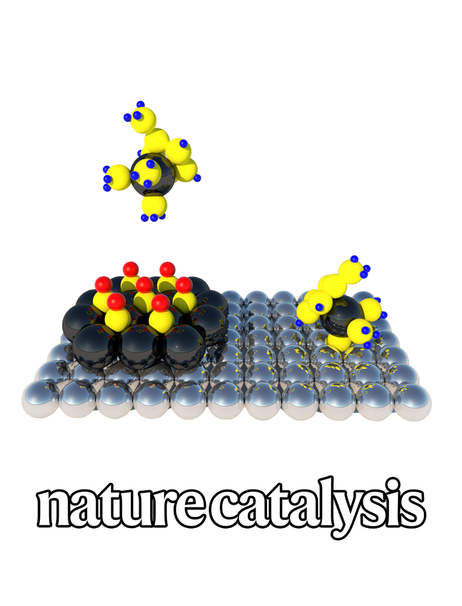

## Highlights

::: {layout="[[32.0,-2.0,32.0,-2.0,32.0]]"}


:::

::: {layout="[[32.0,-2.0,32.0,-2.0,32.0]]"}



:::

> <sup>&#10033;</sup> contributed equally, <sup><b>&#x25C7;</b></sup> corresponding author

## Preprints

```{python}
from pybtex.database.input import bibtex
from IPython.display import display, Markdown, HTML


def readable_list(author_list):
    if len(author_list) == 1:
        return str(author_list[0])
    elif len(author_list) < 3:
        return ' and '.join(map(str, author_list))
    *a, b = author_list
    return f"{', '.join(map(str, a))}, and {b}"


def button(url, label, icon):
    icon_base = icon[:2]
    return f"""<a class="btn btn-outline-primary btn-sm", href="{url}" target="_blank" rel="noopener noreferrer">
    <i class="{icon_base} {icon}" role='img' aria-label='{label}'></i> {label} </a>"""


def format_entry(fields, persons):
    # Names
    names = [' '.join([b[0] + '.' for b in a.first_names]) + ' ' + ' '.join([c[0] + '.' for c in a.middle_names]) +
             ' ' + ' '.join(a.last_names) for a in persons['author']]
    name_string = readable_list([n.replace('  ', ' ').replace('Â', '') for n in names]) \
                   .replace('P. Schindler', '<em class="text-primary">P. Schindler</em>').replace("+", "<sup><b>&#x25C7;</b></sup>").replace("*", "<sup>&#10033;</sup>")

    # Title
    title = fields['title'].replace('{', '').replace('}', '').replace('O2', 'O<sub>2</sub>').replace('O3', 'O<sub>3</sub>')

    # Year
    year = fields['year']

    # Volume and Issue
    vi = ' '
    if 'volume' in fields:
        vi += fields['volume']
    if 'number' in fields:
        vi += ', ' + fields['number']

    # Pages
    page = fields['pages'].replace('--', '–') if 'pages' in fields else ''

    # Journal
    if 'journal' in fields:
        journal = fields['journal'].replace('\\', '')
    elif 'publisher' in fields:
        journal = fields['publisher']
        if 'note' in fields:
            vi = ' ' + fields['note']
    else:
        raise ValueError('Error. No journal or publisher specified.')

    # DOI
    try:
        doi = fields['doi']
    except KeyError:
        doi = None

    return {
        'name_string': name_string,
        'title': title,
        'year': year,
        'vi': vi,
        'page': page,
        'journal': journal,
        'doi': doi,
        'comment': fields.get('comment'),
    }


def render_entry(entry, value):
    html = f"<li value='{value}'>\n"
    html += f"<i>{entry['title']}</i><br>\n"
    html += f"<b>{entry['journal']}{entry['vi']} ({entry['year']})</b> {entry['page']}<br>\n"
    html += f"<small>{entry['name_string']}</small><br>\n"
    if entry['doi'] is not None:
        html += button('https://doi.org/' + entry['doi'], 'Published', 'ai-archive')
    if entry['comment']:
        for link in str(entry['comment']).split(';'):
            if 'arxiv.org' in link or "chemrxiv" in link:
                html += ' ' + button(link, 'Preprint', 'bi-file-earmark-pdf')
            if 'github.com' in link:
                html += ' ' + button(link, 'GitHub', 'bi-github')
    html += "</li>"
    return html


parser = bibtex.Parser()
bib_data = parser.parse_file('biblio.bib')

all_entries = [format_entry(bib_data.entries[e].fields, bib_data.entries[e].persons) for e in bib_data.entries]

# Entries that only have a preprint (arXiv/chemRxiv) and no DOI yet are not peer-reviewed.
preprint_entries = [entry for entry in all_entries if entry['doi'] is None]
paper_entries = [entry for entry in all_entries if entry['doi'] is not None]

n_papers = len(paper_entries)
n_total = len(all_entries)

if preprint_entries:
    preprint_html = f'<ol class="rbracket" style="counter-reset: num {n_total+1};list-style-type: none;">\n'
    for ind, entry in enumerate(preprint_entries):
        preprint_html += render_entry(entry, n_total - ind)
    preprint_html += "</ol>\n"
    display(HTML(preprint_html))
else:
    display(Markdown('Currently no preprints that have not been peer-reviewed.'))
```

## Peer-reviewed Publications

```{python}
paper_html = f'<ol class="rbracket" style="counter-reset: num {n_papers+1};list-style-type: none;">\n'
for ind, entry in enumerate(paper_entries):
    paper_html += render_entry(entry, n_papers - ind)
paper_html += "</ol>\n"

display(HTML(paper_html))
```
